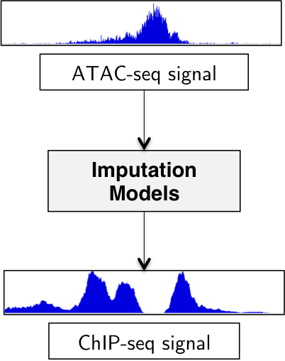
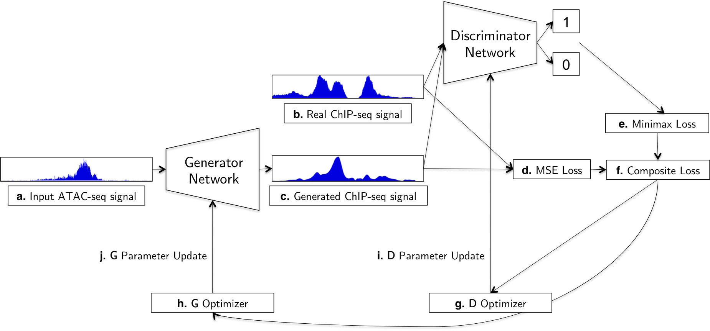
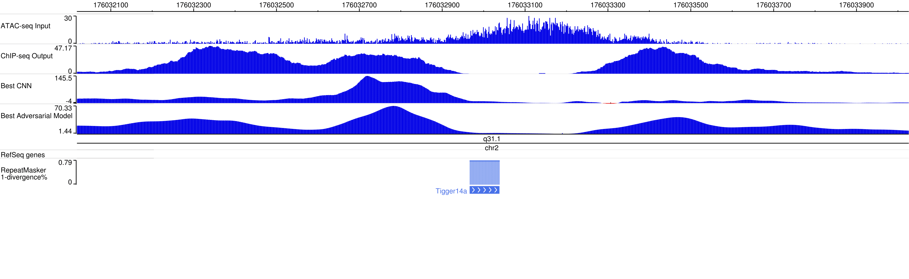
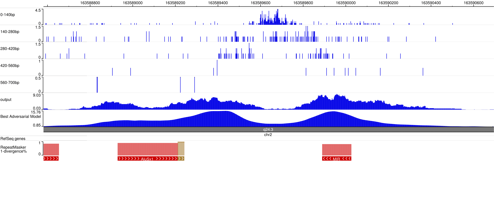

#  A Sequence-to-sequence Regression of Genome-wide Chromatin Data Through Adversarial Training

This repository contains the implementation for my honors thesis paper: **A Sequence-to-sequence Regression of Genome-wide Chromatin Data Through Adversarial Training**.

We impute histone ChIP-seq signal from ATAC-seq signal using the adversarial training approach we propose in the paper. 

Here's the idea: 

We introduce three major modifications to the vanilla generative adversarial network architecture.
1. Generator component of deep adversarial network so that the generator takes ATAC-seq signal instead of random noise and outputs ChIP-seq signal
2, Composite loss function that takes account of both mean squared error and adversarial loss
3. One-sided label smoothing as introduced in Salimans et al.(2016)

We trained our model on GeForce GTX TITAN X for 300 epochs.

Here are few visualizations created with WashU Epigenome Browser.

The first visualization shows how the generator trained through adversarial training outperforms the CNN-based model. We can observe that the adversarial model captures all three ChIP-seq peaks, while the CNN only capture one ChIP-seq peak in the middle. Although the leftmost ChIP-seq peak is not as clearly distinguishable as the other two peaks are, we still get a clear sense that there are three major peaks where ChIP-seq signal is signicant.

The second visulization is another visualization of prediction made by the generator trained through adversarial training. The position where the ATAC-seq peak occurs in the first channel represents nucleosome-free regions, where the ChIP-seq signal does not usually exist. The adversarial model correctly predicts that there would be no ChIP-seq signal at this particular position. The positions where the ATAC-seq peaks are present in the second and the third channels represent nucleosomal regions where the ChIP-seq peaks usually exist, and the adversarial model also very clearly predicts the two peaks in the nucleosomal regions. This result is promising and suggests that adversarial model can capture biological implication between ATAC-seq and ChIP-seq signal.

For more details, please refer to the paper. Note that we cannot provide our ATAC-seq and ChIP-seq dataset used in the paper.

## How to Run

### Implementation of adversarial model and CNN baseline model
 - [train_adversarial_model.py](https://github.com/jessemin/AdversarialSeqToSeq/blob/master/train_adversarial_model.py "train_adversarial_model.py")
 - [train_cnn.py](https://github.com/jessemin/AdversarialSeqToSeq/blob/master/train_cnn.py "train_cnn.py")
 
### Implementation of chromosome-wide evaluation
 - [evaluate_adversarial_chromwide.py](https://github.com/jessemin/AdversarialSeqToSeq/blob/master/evaluate_adversarial_chromwide.py "evaluate_adversarial_chromwide.py")

### Training scripts
 - [run_adversarial_training.py](https://github.com/jessemin/AdversarialSeqToSeq/blob/master/scripts/run_adversarial_training.py "run_adversarial_training.py")
 - [run_cnn_training.py](https://github.com/jessemin/AdversarialSeqToSeq/blob/master/scripts/run_cnn_training.py "run_cnn_training.py")
 - [run_chromwide_evaluation.py](https://github.com/jessemin/AdversarialSeqToSeq/blob/master/scripts/run_chromwide_evaluation.py "run_chromwide_evaluation.py")

## Dependencies

To install all dependencies, run:

    pip install -r requirements.txt

## Contact

If you have any questions, please contact:

 - Jesik (Jesse) Min: <jesikmin@stanford.edu>

## Collaborators

 - Johnny Israeli
 - Daniel Kim
 - Dr. Paul Khavari, MD
 - Dr. Mike Snyder
 - Dr. Anshul Kundaje

## References

[1] Partially adopted the implementation from:
<https://github.com/eriklindernoren/Keras-GAN/tree/master/gan>
[2] Salimans, T., Goodfellow, I., Zaremba, W., Cheung, V., Radford, A. and Chen, X. (2018). Improved Techniques for Training GANs. [online] Arxiv.org. Available at: https://arxiv.org/abs/1606.03498 [Accessed 6 May 2018].
